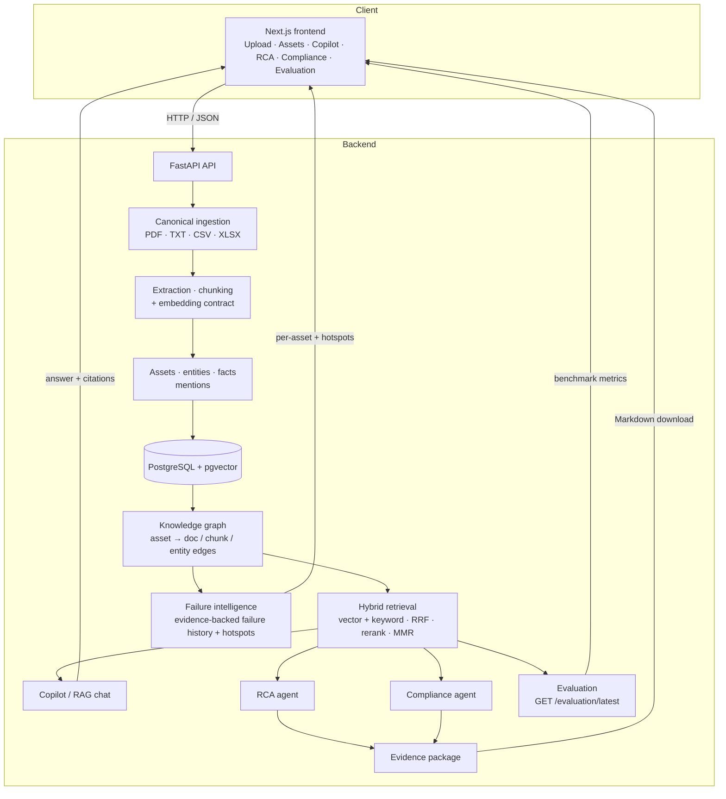

# AssetMind AI — Architecture

AssetMind AI is a document-to-decision pipeline: raw industrial documents enter
through one **canonical ingestion** path, become an asset-centric knowledge graph
in **Postgres + pgvector**, and are served back as grounded answers, root-cause
analyses, compliance findings and evidence packages — all citation-backed.

## System diagram

## Flow

1. **Frontend (Next.js)** calls the **FastAPI API** over JSON.
2. **Canonical ingestion** accepts PDF/TXT/CSV/XLSX. Tabular rows become
   row-chunks; PDFs/TXT are character-chunked with page markers. One embedding
   contract (§ below) tags every chunk with the *active* provider's model.
3. **Extraction / chunking** produces chunks + vectors; **entity extraction**
   pulls equipment tags (`P-101`, `C-220`, …).
4. **Assets / entities / facts / mentions** are upserted into
   **PostgreSQL + pgvector**.
5. The **knowledge graph** materialises `asset → document / chunk / entity` edges
   (inline on ingest, or via `scripts.backfill_knowledge_edges`).
6. **Hybrid retrieval** blends pgvector similarity and keyword search with
   Reciprocal Rank Fusion, a lightweight rerank and MMR diversification.
7. **Copilot**, **RCA** and **Compliance** all read from the same retrieval +
   evidence layer, so every answer is grounded in real chunks.
8. The **evidence package** compiles compliance gaps + inspection/maintenance
   evidence into a downloadable Markdown report.
9. **Failure intelligence** (`GET /assets/{tag}/failure-intelligence`,
   `GET /dashboard/failure-hotspots`) is a read-only derived view over persisted
   mentions: documented failure modes, repeated modes, recent events and
   maintenance actions — every item citation-backed. It is retrospective, never a
   prediction, and writes no graph edges (so it cannot create duplicates).
10. **Evaluation** replays the benchmark through the production retrieval path and
    is served read-only at `/evaluation/latest`.

## Deterministic local mode vs Gemini mode

| Concern | Deterministic local (default) | Gemini mode |
|--------|-------------------------------|-------------|
| Trigger | `GEMINI_API_KEY` unset | `GEMINI_API_KEY` set |
| Embeddings | `local-hashing-v1` (384-dim, deterministic) | `gemini-embedding-2` |
| Answer generation | extractive (no LLM) | `gemini-2.5-flash` |
| RCA reasoning | deterministic evidence assembly | Gemini (`LLM_PROVIDER=gemini`) |
| Network | none | Gemini API |

The demo and the reported benchmark run in **deterministic local mode** — fully
reproducible, offline, and honest about not invoking an LLM.

## Embedding-model compatibility (the single contract)

Uploads and queries **must** use the same embedding provider/model or vectors are
incomparable. Ingestion tags each chunk with `rag.embeddings.active_model()` — the
exact model the query side uses — so a document uploaded through the UI is
immediately retrievable by Copilot. Switching providers requires re-indexing under
the new provider, never a code change. Vectors are 384-dimensional (`pgvector`).

## Synthetic demo data

The demo plant is **synthetic**. Pump documents come from
`data/generate_pdfs.py`; the compressor datasheet, compressor SOP and RCA
findings from `data/generate_extended_corpus.py`. Work orders derive from a public
synthetic Kaggle dataset. No proprietary/standard text is reproduced verbatim.

## Persistence & storage

- **PostgreSQL + pgvector** holds documents, pages, chunks (+ vectors), entities,
  assets, mentions and knowledge edges. Migrations via Alembic.
- **Local filesystem** (`storage/`) holds uploaded originals and generated
  evidence packages (`storage/exports/`). These are **ephemeral** on container
  platforms — see [deployment.md](deployment.md).
